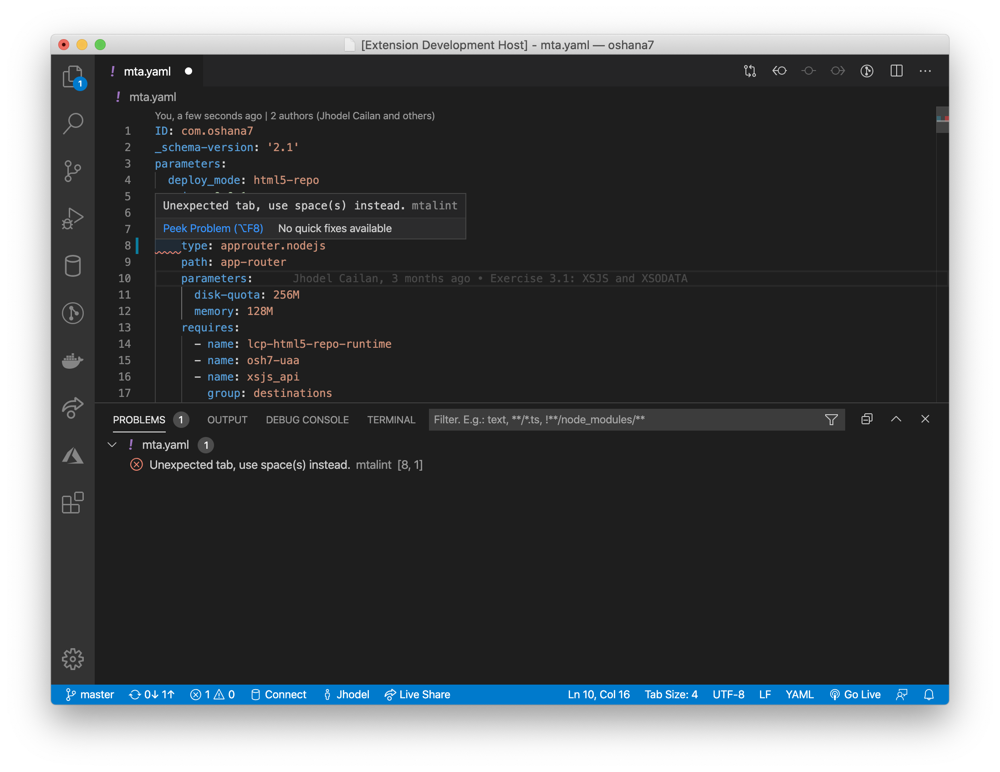

# Change Log

All notable changes to the **Blue Phoenix** extension will be documented in this file.

#### Unreleased
	
> Still tinkering on what should be the next feature to add

#### Release 1.3.0

- Added syntax highlighting for *.csn files
- Added icon theme for *.edmx, *.csn, and *.db files

#### Release 1.2.0

- Added a linting capability for MTA.yaml
	- Highlight error when tab was used for indention

#### Release 1.1.0

- SQLScript Language Support
	- Format a range of selected code
- File Icon Theme
	- Adjusted the icons for easy identification (HANA, XS, and CDS artifacts)

#### Release 1.0.0

- SQLScript Language Support
	- Syntax highlighting
	- Grammar: auto indentation and closing
	- Source code formatting
- HANA Configuration Artifacts
	- JSON Syntax Highlighting
- XSJS Framework
	- Syntax highlighting
	- Grammar: auto indentation and closing
- File Icon Theme Support
	- HANA and XSJS development artifacts