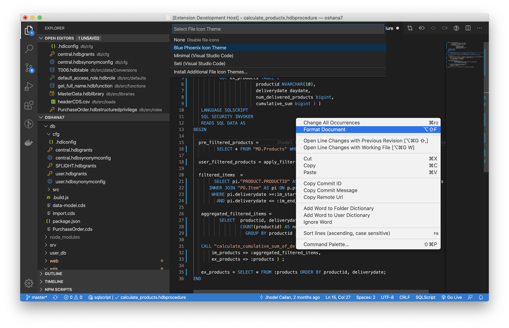

# Blue Phoenix

Blue Phoenix is a VS Code extension which targets support for SAP Development frameworks and programming languages in the Cloud Application Programming Model (CAPM) space.

## Features

- SQLScript Language Support
	- Syntax highlighting
	- Grammar: auto indentation and closing
	- Source code formatting
- HANA Configuration Artifacts
	- JSON Syntax Highlighting
- XSJS Framework
	- Syntax highlighting
	- Grammar: auto indentation and closing
- File Icon Theme Support
	- HANA and XSJS development artifacts

## SAP XSJS Language Support

This is to support syntax highlighting for SAP XSJS framework which is based in JavaScript language.

> This piece of VS Code extension was initially published in [VS Code Marketplace](https://marketplace.visualstudio.com/items?itemName=jhodel.jcailan-xsjs) as [SAP XSJS Language Support](https://github.com/jcailan/xsjs) with the intention to just provide syntax highlighting for SAP XSJS framework. Soon after, I found out that there are more features that are missing hence the creation of this project which is more broad in scope that just covering for XSJS framework.

## Appendix

- [MIT License](LICENSE)
- [Change History](CHANGELOG.md)
- [How to contribute](CONTRIBUTING.md)